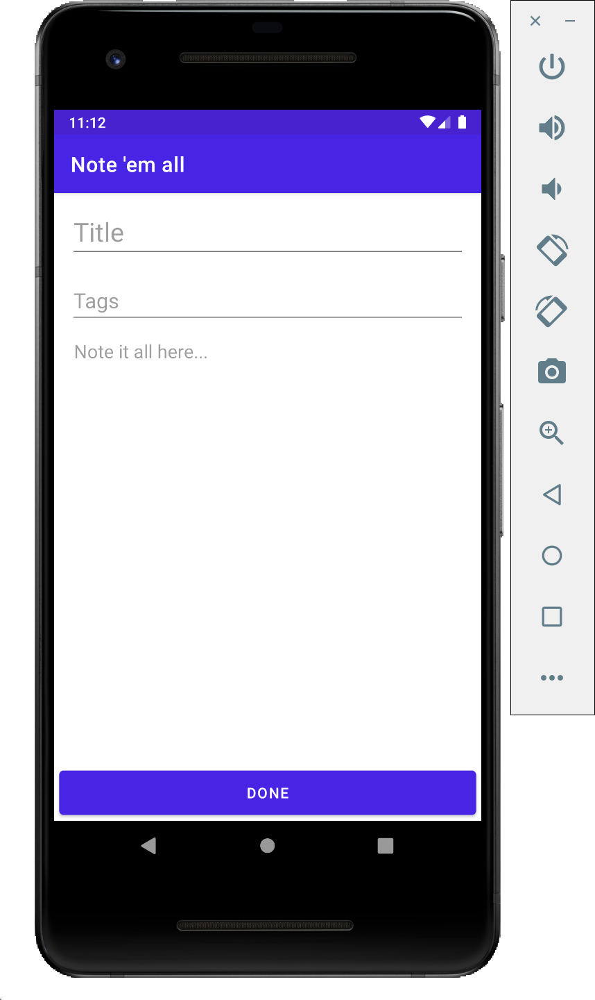
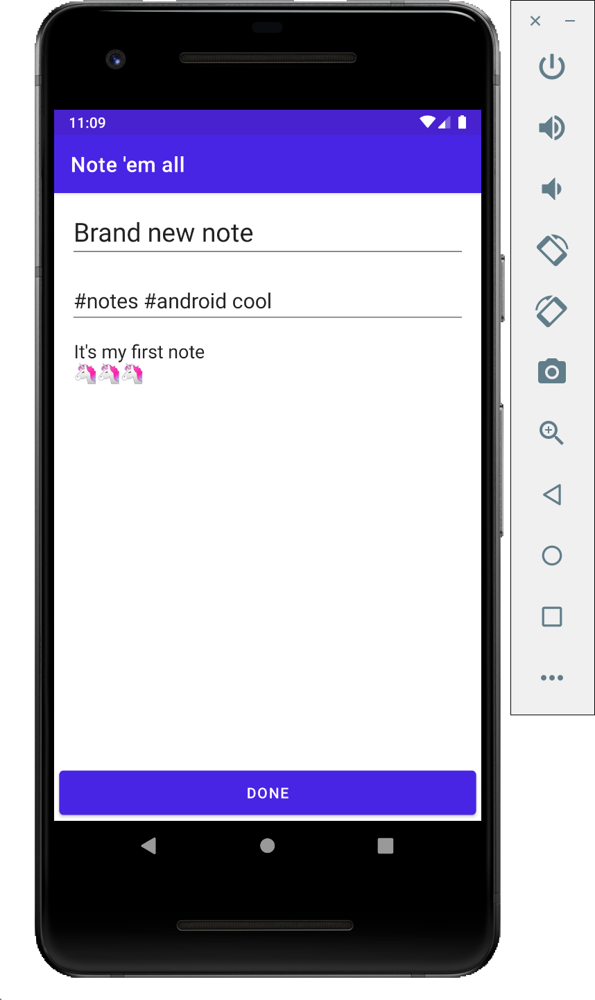
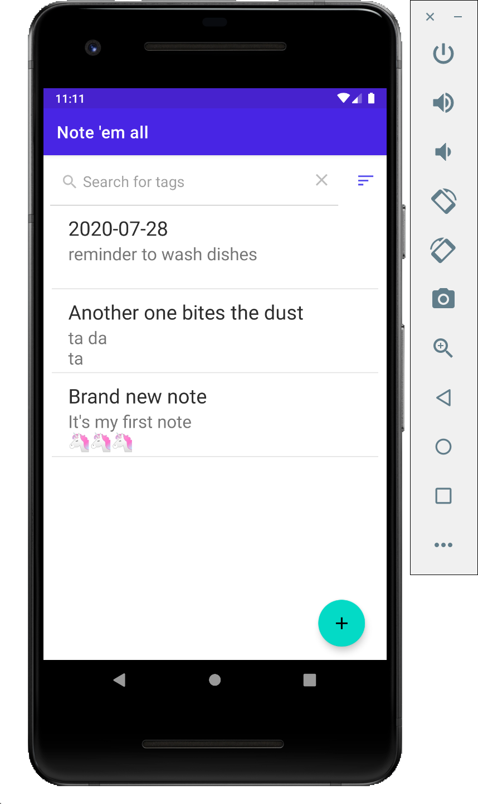
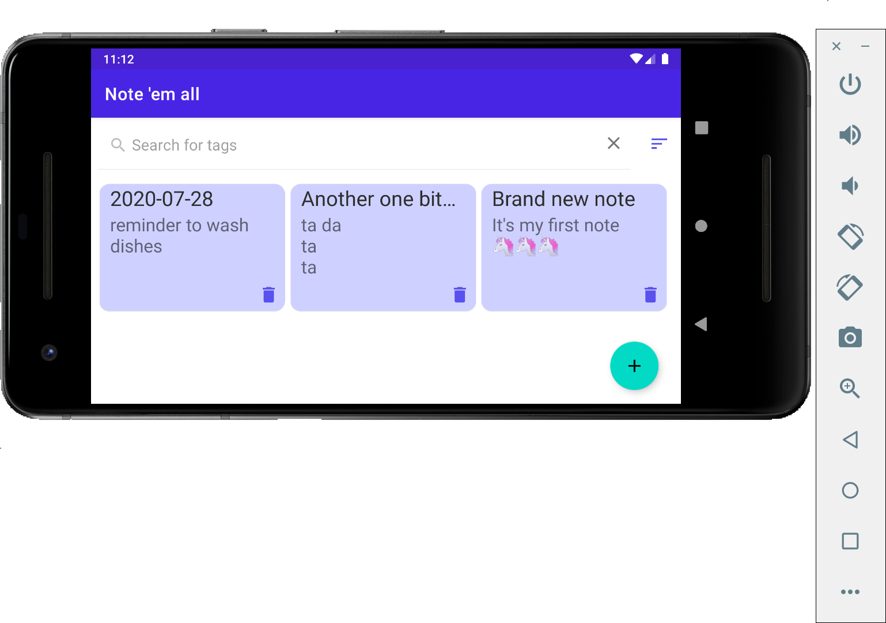
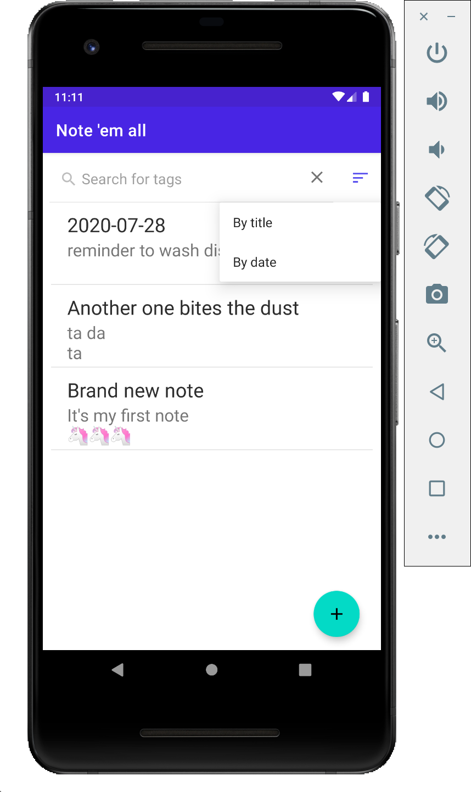
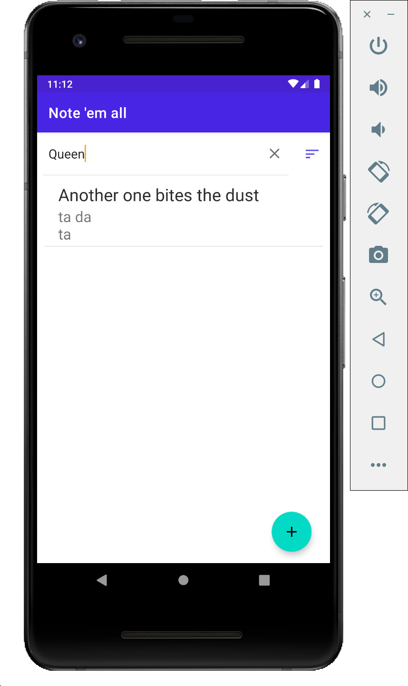

# Note them all

App for taking notes on Android  

## Installation
Clone this repository and import into **Android Studio**
```bash
git clone https://github.com/papuge/Note-them-all.git
```
## Usage
Creating new note is simple as it should be.  
- If no title provided current date will be selected.  
- To add tags write them separated by spaces ('#' can be ommited).  

    


- To delete note swipe it to left.  



- You can also sort notes by title or creation date.  

  

- And filter notes by tags.  

  
